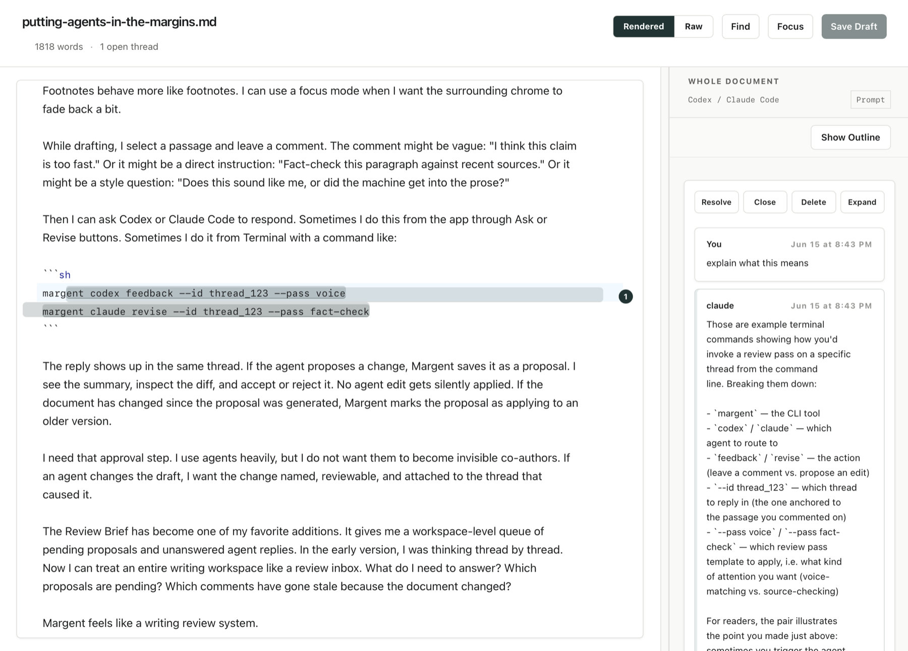

# Margent

Margent is a local-first macOS Markdown review app: write in a rendered-first CodeMirror editor, attach threaded comments to passages, review agent-authored replies and revision proposals, and keep all review state beside the Markdown in `.mdreview/` JSON sidecars.



[Website](https://brehove.github.io/margent/) · [Agent setup](docs/agent-setup.md) · [Agent skill](skills/margent) · [Latest release](https://github.com/Brehove/margent/releases/latest)

## Status

Margent is early, macOS-first software. The desktop app, CLI, sidecar schema, exports, provider actions, and updater workflow are actively evolving, but the repository is organized so user documents and review sidecars stay local-first.

Telemetry: Margent does not phone home or collect documents, comments, prompts, API keys, OAuth tokens, or analytics. Provider calls run through the user's own Codex and Claude Code CLIs.

## What Ships

- Desktop app: Tauri 2, React 19, CodeMirror, file/open-with/deep-link support, Review Brief, project search, exports, native notifications, and update checks from GitHub Releases.
- CLI: `margent` for workspace init, file/thread/proposal CRUD, reanchoring, CriticMarkup import/export, `margent serve`, MCP, Codex/Claude provider actions, agent skill install, `codify`, and `margent open`.
- Agent skill: a shared `skills/margent/SKILL.md` package that teaches Claude Code and Codex how to use the Margent CLI without storing credentials.
- Persistence: Markdown stays as normal files; `.mdreview/` stores documents, threads, proposals, events, agent cursors, review memory, review passes, snapshots, and authorship provenance.

## Agent-First Setup

The public install path is agent-first. Paste the setup prompt from the
[website](https://brehove.github.io/margent/) into Claude Code or Codex, or give
your agent [docs/agent-setup.md](docs/agent-setup.md) directly.

That setup path asks the agent to clone the repo, install the CLI, install the
shared Margent agent skill for Claude Code and Codex, run checks, install the
desktop app into `~/Applications`, and walk the user through Codex or Claude
login if needed.
Margent does not handle provider OAuth itself; login is initiated by the user
through `codex login` or `claude auth login`.

Claude Code-only users can use the same repo without installing or configuring
Codex. After the CLI is installed, initialize each writing workspace with:

```sh
cd /path/to/markdown-workspace
margent init --write-config
claude auth login
claude mcp add margent -- margent mcp --workspace "$PWD"
margent doctor
```

That writes Claude-friendly workspace instructions, registers the Margent MCP
server for the current workspace, and lets `margent doctor` report whether the
Claude CLI, Claude auth, `.mcp.json`, `CLAUDE.md`, and shared skill are ready.

## Prerequisites And Manual Setup

- macOS.
- Node 22 recommended. Node 20 requires 20.19.0 or newer; older Node 20 builds fail with current Vite tooling.
- Rust stable.
- Optional agent providers: Codex CLI and/or Claude Code. Margent uses whichever of these CLIs you install and log into through their own tools.

Margent does not collect API keys or OAuth tokens. Agent authentication stays in the provider CLIs and macOS Keychain; the desktop app and CLI only check whether `codex` / `claude` are installed and authenticated.

Provider setup:

```sh
# Codex CLI
# Install: https://developers.openai.com/codex/cli
codex login
codex login status

# Claude Code
# Install: https://docs.anthropic.com/en/docs/claude-code/quickstart
claude auth login
claude auth status
```

Then build/install Margent and run:

```sh
margent doctor
```

`margent doctor` prints the exact next command and documentation link for any missing or unauthenticated provider. Codex login details are in the [Codex CLI reference](https://developers.openai.com/codex/cli/reference#codex-login); Claude Code auth details are in the [Claude Code IAM docs](https://docs.anthropic.com/en/docs/claude-code/iam).

## Build

```sh
npm ci
npm run build
npm test

cargo test --manifest-path crates/margent-core/Cargo.toml
cargo test --manifest-path cli/Cargo.toml
cargo test --manifest-path src-tauri/Cargo.toml

npm run tauri build
```

The built app is written under `src-tauri/target/release/bundle/macos/Margent.app`.
For an agent-first local install on the Mac that built it, copy the app bundle
into the user's Applications folder with `ditto`:

```sh
osascript -e 'quit app "Margent"' 2>/dev/null || true
npm run tauri build
mkdir -p ~/Applications
ditto src-tauri/target/release/bundle/macos/Margent.app ~/Applications/Margent.app
open ~/Applications/Margent.app
```

Use `ditto`, not `cp -R`, because it preserves app bundle metadata more
reliably. This local source build is not the same as a signed and notarized
public distribution artifact. To update Margent from source, rerun the build and
`ditto` steps. For development iteration, use `npm run tauri dev`.

## CLI Install

From a tapped checkout:

```sh
brew tap Brehove/margent https://github.com/Brehove/margent
brew install margent
```

From source:

```sh
cargo install --locked --path cli
margent install --agent-skills
margent doctor
```

`margent install --agent-skills` copies the shared skill into
`~/.claude/skills/margent` and `~/.codex/skills/margent`. It leaves existing
skills untouched unless you rerun it with `--force`.

## Using Margent With Claude Code Or Codex

Mode 1: Claude Code or Codex as a reviewer.

```sh
cd /path/to/markdown-workspace
margent init --write-config
margent doctor
```

`margent init --write-config` creates `.mdreview/`, review pass templates, `.mdreview/skills/margent/SKILL.md`, `CLAUDE.md`, `AGENTS.md`, `.mcp.json`, and `.codex/config.toml`. The generated MCP snippets look like this:

```json
{
  "mcpServers": {
    "margent": {
      "command": "margent",
      "args": ["mcp", "--workspace", "/path/to/markdown-workspace"]
    }
  }
}
```

```toml
[mcp_servers.margent]
command = "margent"
args = ["mcp", "--workspace", "/path/to/markdown-workspace"]
```

Manual equivalents:

```sh
claude mcp add margent -- margent mcp --workspace /path/to/markdown-workspace
codex mcp add margent -- margent mcp --workspace /path/to/markdown-workspace
```

Then ask the agent to review `draft.md`, reply to open threads, propose fixes, or run a pass:

```sh
margent claude feedback --id thread_123 --pass voice
margent claude revise --id thread_123 --pass fact-check
margent codex feedback --id thread_123 --pass voice
margent codex revise --id thread_123 --pass fact-check
```

Replies and proposals appear live in the desktop app through the `.mdreview/` watchers.

Mode 2: Margent UI inside the Codex in-app browser.

```sh
cd /path/to/markdown-workspace
margent serve --port 7345
```

Open the printed `http://127.0.0.1:7345/?token=...` URL in Codex’s in-app browser. Use `/brief` for the Review Brief route. The browser pane is the shared view; Codex still acts through CLI/MCP primitives. The served UI is localhost-only and token-gated, but the Codex in-app browser does not provide a separate login layer.

Claude uses the same split: Claude Code can act through CLI/MCP, while Chrome can display the `margent serve` URL.

## Opening Codex Output Files In Margent

One-time macOS setup: in Finder, select a `.md` file, choose Get Info, set Open With to Margent, then Change All. After that, `open <file.md>` and many Cmd-click flows route Markdown to Margent.

Best agent handoff: when an agent creates or edits a Markdown file for review, it should run:

```sh
margent open path/to/file.md
```

For a specific thread:

```sh
margent open path/to/file.md --thread thread_123
```

If the file sits under an initialized Margent workspace, `margent open` emits and launches a `margent://open?workspace=...&doc=...&thread=...` deep link so the app opens with full review context. For a plain Markdown file outside a workspace, it falls back to `open -a Margent <file>`.

Manual fallback:

```sh
open -a Margent path/to/file.md
```

## Project Layout

- `src/`: React app and editor UI.
- `src-tauri/`: Tauri desktop app, Rust commands, services, capabilities, signing entitlements.
- `cli/`: Rust CLI, MCP server, serve mode, provider actions.
- `crates/margent-core/`: shared record types, anchor/deep-link/context/CriticMarkup/authorship logic.
- `docs/`: sidecar spec, release notes, schemas, and screenshots.
- `Formula/`: Homebrew formula for the CLI.
- `AGENTS.md`: public agent/contributor conventions.
- `CLAUDE.md`: Claude Code-specific project instructions.

## Docs

- [Product spec](docs/SPEC.md)
- [Acceptance checklist](docs/ACCEPTANCE.md)
- [`.mdreview` sidecar spec](docs/mdreview-spec.md)
- [Release and distribution](docs/release.md)
- [Contributing](CONTRIBUTING.md)
- [Security](SECURITY.md)

## License

Margent is licensed under the [MIT License](LICENSE).
